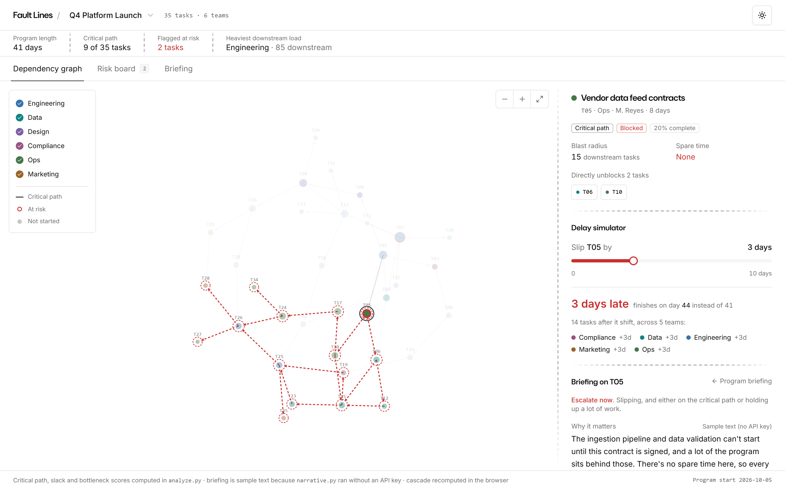
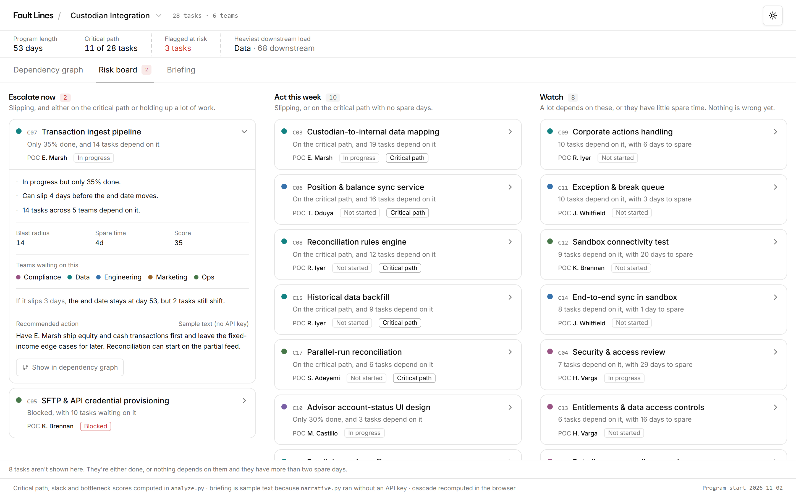
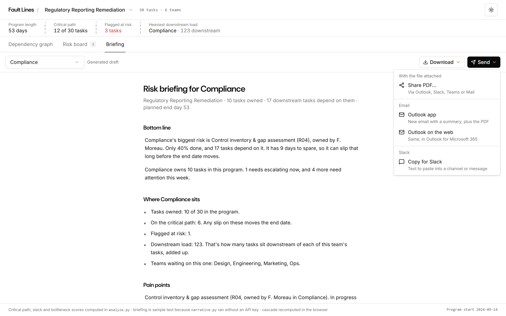
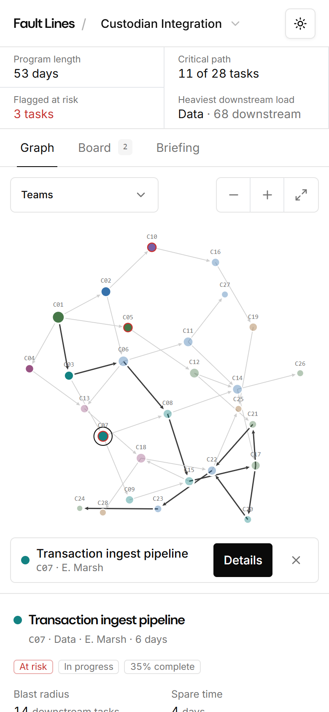
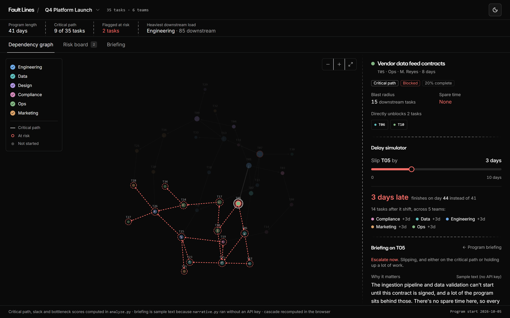

# Fault Lines - The Program Manager tool

Fault Lines finds the handful of tasks that actually threaten a program's
delivery date, shows what a slip would cost before it happens, and drafts the
risk briefing a program manager would send to each team.

**Live demo:** https://fault-lines-ui.vercel.app (no sign-in, works on a phone)



## Why it exists

In a weekly status meeting every team reports its own work, and most of it is
"on track". The risk hides in the gaps between teams. A vendor contract that
Ops is waiting on blocks the Data pipeline, which blocks Engineering, which
blocks the Compliance sign-off, which blocks the launch. No single team's
status shows that.

Jira can tell you a ticket is blocked. It can't tell you that the ticket costs
the program three days and stalls four other teams. Fault Lines answers that
second question, and then writes it up in language a VP can act on in five
minutes.

## What you can do with it

### See the whole program as one graph

Every task is a node, colored by team, with arrows for what it depends on.
The critical path is drawn in bold, and tasks at risk get a red ring. Click
or tap any node to see its owner, status, progress, how many tasks sit
downstream of it (its blast radius) and how many days it can slip before the
end date moves (its spare time, or float). Drag, pan, zoom, and filter by team.

### Ask "what if this slips?"

The delay simulator lets you push any task out by 0 to 10 days and watch the
cascade in real time. It shows which tasks shift, by how much, which teams
absorb it, and whether the end date moves. A task with 4 days of float can
slip 4 days for free; on day 5 the launch moves. The simulator makes that
threshold visible instead of leaving it as a number in a column.

### Triage on a risk board



Tasks are sorted into three lanes, straight from the analysis:

| Lane | What puts a task there |
| --- | --- |
| **Escalate now** | It's slipping, and it's either on the critical path or holding up a lot of work |
| **Act this week** | It's slipping, or it's on the critical path with no spare days |
| **Watch** | Nothing is wrong yet, but a lot depends on it or it has little spare time |

Each ticket shows the owner (POC) and status, and expands into the reasons
it's flagged, its score, the teams waiting on it, what a 3-day slip would do,
a recommended action, and a jump back to the graph. Tasks that are done, or
that nothing depends on, are left off so the board stays short.

### Get a briefing for any task, or for a whole team

Select any task and you get a short briefing on it: which lane it's in, why
it matters, and what to do about it.



The Briefing tab builds a full report for the whole program or for one team.
It has a bottom line, where the team sits, its pain points, what to do this
week and what to watch. Every section is editable before you send it, and a
reset puts the generated draft back.

### Send it where your team already works

- **Download** as a Word document, a PDF, or Markdown, or copy it as Markdown.
- **Share PDF** opens the device share sheet with the file attached (Outlook,
  Slack, Teams, Mail) on browsers that support it.
- **Outlook app / Outlook on the web** opens a new email with the summary
  written in and downloads the PDF to attach.
- **Copy for Slack** puts Slack-formatted text on the clipboard, ready to paste.

### Switch between programs

Three example programs ship with the app, each written to show a different
kind of risk (see [The example data](#the-example-data)). Pick one from the
menu next to the logo. Every program has its own URL, so you can link
straight to one.

### Use it anywhere

The layout works from a 360px phone up to a wide monitor, in light or dark
mode. On a phone the graph takes touch input, and a selection bar opens the
task details.

<p align="center">
  
  &nbsp;&nbsp;
  
</p>

## How it works

The heavy lifting happens once, in Python, and the web app reads the result.

```
programs/*.py ──> generate_data.py ──> analyze.py ──> narrative.py ──> data/programs/<slug>/
  task lists        tasks.json          critical path,    Claude writes     read by the
  and owners                            slack, scores,    the briefing      Next.js app
                                        cascades
```

1. **Generate.** Each program is a hand-written list of tasks with owners,
   teams, durations, statuses and dependencies.
2. **Analyze.** `analyze.py` builds the dependency graph with NetworkX and
   runs the critical path method: earliest and latest start for every task,
   which gives its float. It then scores bottlenecks by blast radius, weighted
   up for tasks that are at risk or on the critical path, and pre-computes
   delay cascades.
3. **Narrate.** `narrative.py` sends the analysis to Claude and asks for a
   headline, the top risks in plain language, and one concrete mitigation per
   risk, using structured outputs so the response always has the right shape.
   Claude never computes a number. Every figure comes from the analysis, and
   Claude only writes the prose around it.
4. **Serve.** The Next.js app is statically generated from that output, one
   page per program. The only thing it computes itself is the delay cascade,
   so the slider responds instantly. That port is checked against the Python
   analysis: every task, at every delay from 1 to 10 days, in all three
   programs (930 cases), with no differences.

Without an API key, `narrative.py --mock` fills the same structure with
stand-in prose, still taking every number from the analysis. The output
records whether it was written live or mocked, and the app labels mocked text
as sample text so it never claims Claude wrote something it didn't.

## The example data

The three programs are **synthetic**. They're written so that each one shows
a different risk pattern, and they are not real program or company data.

| Program | Tasks | What it shows |
| --- | --- | --- |
| Q4 Platform Launch | 35 | A blocked task on the critical path. T05, a vendor data contract, has no float, so every day it waits moves the launch a day. 15 tasks across 5 teams sit behind it. |
| Custodian Integration | 28 | Blocked isn't the same as critical. The blocked task (C05) has 20 days of float and never moves the date. The real threat is C07, which is only 35% done and moves go-live once it slips more than 4 days. |
| Regulatory Reporting Remediation | 30 | A team is the bottleneck, not a task. Every workstream converges on Compliance, whose downstream load is roughly double the next team's. |

The briefings in the deployed app were generated in mock mode, so they're
labeled as sample text.

## Running it locally

You need Node 20+ and, optionally, Python 3.

```bash
# 1. The analysis (optional: the app ships with its data already generated)
cd fault-lines
pip install -r requirements.txt
python run_pipeline.py --mock        # drop --mock and set ANTHROPIC_API_KEY for Claude-written briefings

# 2. The web app
cd ../fault-lines-ui
npm install
npm run dev                          # http://localhost:3000, re-runs the pipeline first if Python is available
```

Other useful commands, from `fault-lines-ui/`:

| Command | What it does |
| --- | --- |
| `npm run build` | Production build. Re-syncs the data first, and skips that step cleanly where there's no Python (as on Vercel). |
| `npm run verify:cascade` | Checks the app's delay cascade against the Python analysis |
| `npm run report` | Prints a program or team briefing as Markdown from the command line |

Deploying is `npx vercel --prod` from `fault-lines-ui/`. The generated data is
committed, so Vercel doesn't need Python.

## Tech stack

- **Analysis:** Python, NetworkX, the Anthropic SDK (Claude with structured outputs)
- **Web app:** Next.js 15 (App Router, static generation), React 19, TypeScript, Tailwind CSS 4, shadcn/ui and Radix
- **Graph:** d3-force for layout, with hand-written drag, pan, zoom and touch handling in React
- **Exports:** `docx` for Word, `@react-pdf/renderer` for PDF, both loaded only when used
- **Hosting:** Vercel

## Repository layout

```
fault-lines/          Python analysis pipeline
  programs/             the three example programs
  generate_data.py      writes a program's tasks.json
  analyze.py            critical path, slack, bottleneck scoring, delay cascade
  narrative.py          Claude risk briefing (live) or stand-in text (--mock)
  run_pipeline.py       runs all three steps for every program
  dashboard.html        the original single-file D3 prototype

fault-lines-ui/       Next.js web app, deployed to Vercel
  src/app/[program]/    one statically generated page per program
  src/components/       graph, risk board, briefing, simulator, exports
  src/lib/fault-lines/  cascade, severity lanes, report builder, Word/PDF export
  src/data/programs/    pipeline output, committed (this is what Vercel serves)
  scripts/              data sync, cascade verification, report CLI
  LIVE-MONITORING.md    design for Jira ingest and live Claude monitoring

docs/screenshots/     images used in this README
```

More detail in [`fault-lines/README.md`](fault-lines/README.md) and
[`fault-lines-ui/README.md`](fault-lines-ui/README.md).

## Known limitations

- A task counts as **at risk** when it's blocked, or in progress and under 50%
  complete. That's a simple rule. It doesn't yet compare progress against how
  much time has passed.
- The critical path method assumes fixed durations and finish-to-start
  dependencies. It shows structural risk, and it isn't a forecast.
- Browsers can't attach a file to an email draft on their own, so the Outlook
  options open the email and download the PDF for you to drag in. Share PDF
  attaches it directly where the browser supports file sharing.
- Connecting to Jira for live data is designed
  ([`LIVE-MONITORING.md`](fault-lines-ui/LIVE-MONITORING.md)) but not built yet.
